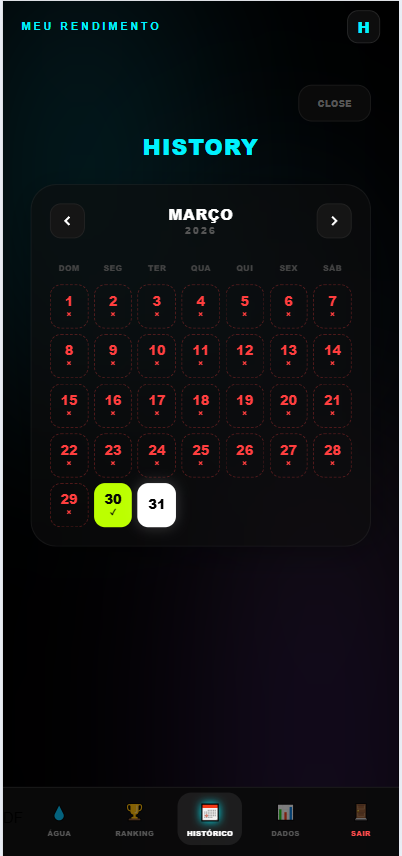
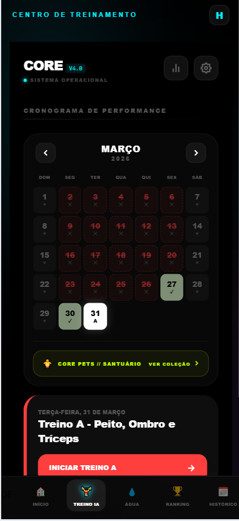
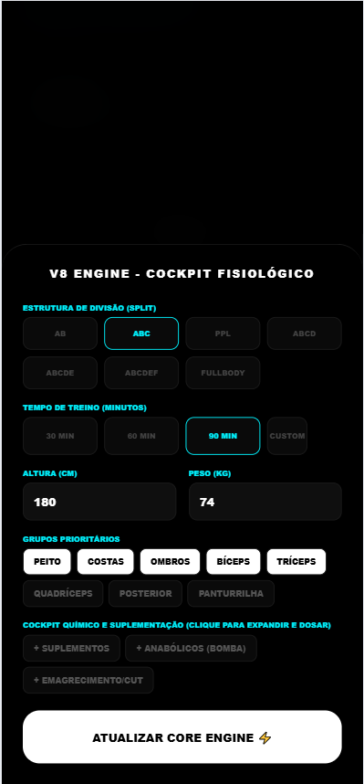
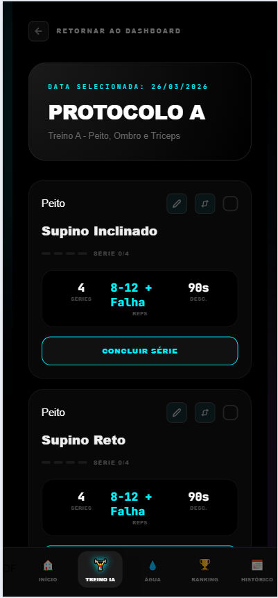
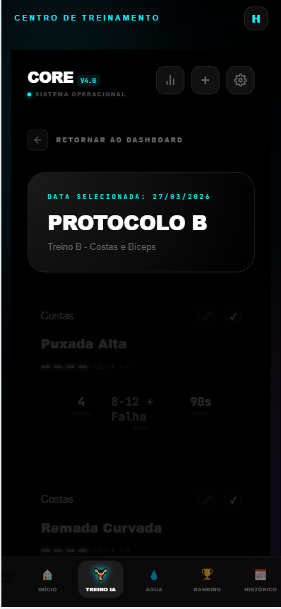
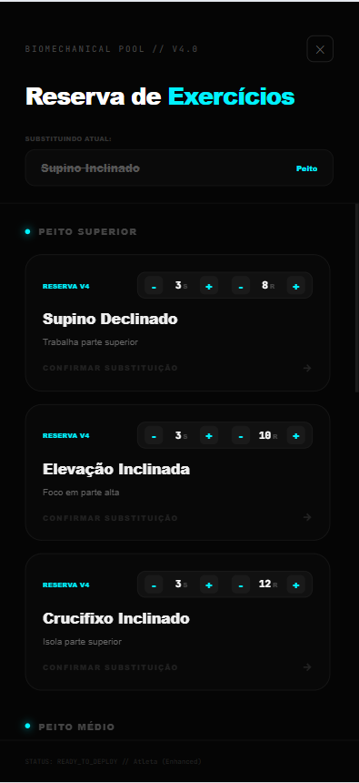
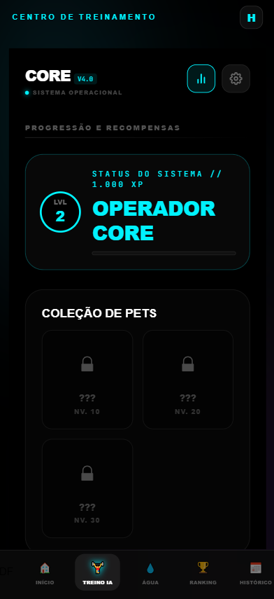
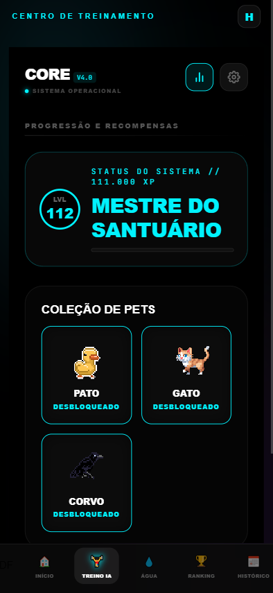
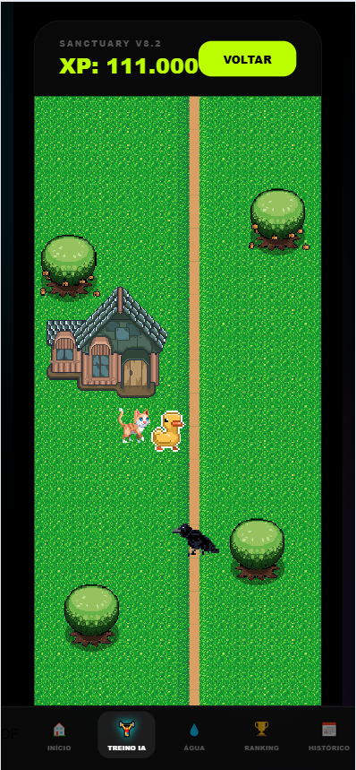

# 🥗 Dieta Fácil - V3 (Gamificação, IA & Fitness)


---

## 🕒 Histórico de Versões (Legacy vs. Production)

O projeto passou por uma refatoração completa de arquitetura para suportar persistência de dados e segurança multicamadas.

| Versão | Status | Acesso Direto | Diferenciais Técnicos |
| :--- | :--- | :--- | :--- |
| **V1.0 (MVP)** | `Legacy` | [**Visitar V1** 🚀](https://dieta-v1.vercel.app/) | LocalStorage, JSON Estático, Protótipo de UI. |
| **V2.0 (Core)** | `Stable` | [**Visitar V2** ✨](https://dieta-ia-v2.vercel.app/) | Firebase, MFA, Gemini 2.0 Flash, Cloud Persistence. |
| **V3.0 (Evolution)** | `Production` | [**Visitar V3** 🔥](https://dieta-ia-v3.vercel.app/) | Gamificação (XP/Pets), Treinos IA, Groq Inference, Spritesheets, Segurança Regex. |

---


> **Dieta Fácil** evoluiu de uma ferramenta de consulta para um ecossistema completo de saúde. O projeto integra Inteligência Artificial generativa de baixa latência, persistência em nuvem, segurança defensiva e uma camada robusta de gamificação (RPG) para o projeto de graduação de Henrique Castro.

---

## 🚀 Evolução do Projeto

### 🟢 Versão 2.0 (Escalabilidade & Cloud)
* **IA Generativa**: Migração para o modelo `gemini-2.0-flash`, otimizando a velocidade de resposta em 40%.
* **JSON Mode Nativo**: Implementação de `responseMimeType: "application/json"` para garantir dados estruturados.
* **Persistência Cloud**: Migração total do LocalStorage para **Firebase Firestore**, permitindo sincronização em tempo real.
* **Segurança Ativa**: Implementação de **MFA (Multi-Factor Authentication)** nativo e gestão profissional de identidade via Firebase Auth.
* **Arquitetura Clean**: Separação definitiva entre camadas de serviço (`GeminiService`, `DBService`) e componentes de UI.

### 🔵 Versão 3.0 (Gaming & Fitness Integration)
* **Gamificação (RPG)**: Implementação de um sistema de XP, Níveis e Títulos baseados na constância do usuário.
* **Coleção de Pets**: Sistema de recompensas visuais com desbloqueio de Pets animados (Pato, Gato e Corvo) conforme o progresso.
* **Módulo de Treino IA**: Geração de rotinas de exercícios personalizadas baseadas no biótipo e objetivos do usuário.
* **Segurança de Identidade**: Validação estrita de passwords via RegEx (mínimo 8 caracteres, exigência de números e caracteres especiais).
* **IA Migration**: Migração para o modelo `groq IA`, otimizando a velocidade de resposta em 60%, com mais tokens para ser.


## 🎮 Sistema de Gamificação (RPG)

O sistema utiliza uma "Fonte da Verdade" lógica para calcular o progresso do utilizador com base no histórico de treinos.

### 📈 Lógica de Experiência (XP)
A fórmula de progressão foi desenhada para premiar a consistência (Streaks):
* **Base XP**: 500 por atividade concluída.
* **Bónus por Combo**: 300 XP por dia consecutivo (Streak).
* **Limite de Bónus**: Cap de 1500 XP atingido no 6º dia seguido.

### 🐾 Recompensas e Pets
| Nível | Título | Pet Desbloqueado |
| :--- | :--- | :--- |
| **LVL 10** | Operador Core | **Pato** (Ducky) |
| **LVL 20** | Operador Core | **Gato** (Walk) |
| **LVL 30+** | Mestre do Santuário | **Corvo** (Crow) |

---

## 🛡️ Segurança e Identidade

O projeto segue padrões rigorosos de engenharia de software para proteção de dados:
* **Autenticação**: Gestão profissional de identidade via Firebase Auth.
* **Validação de Cadastro**: O sistema impede palavras-passe fracas, exigindo complexidade mínima de 8 caracteres e caracteres especiais.
* **MFA**: Segurança em duas etapas implementada para prevenir acessos indevidos.

---

## 📸 Screenshots do Projeto

| Tela de Pesquisa | Cálculo de Macros |
| :---: | :---: |
|   | 
|   | 
|   |
|   |

| MFA | Recuperar acesso
| :---: | :---: |
|  |
|  |
|  |

| Controle de Água | Ranking e Gamificação |
| :---: | :---: |
|  |
|  | 
|  | 
|  | 
|   |
|   |
|   |

| Historico | Calendario |
| :---: | :---: |
|  |
|  |
|  |
|  |
|  |
|  |
|  |

| Dados |
| :---: |
|  |
|  |


| Treino | Gameficaçao |
| :---: | :---: |
|  |
|  |
|  |
|  |
|  |


|  |
|  |
|  |
|  |

---

## 🛠️ Tecnologias Utilizadas

* **Frontend**: React + TypeScript (Type-Safe Architecture).
* **Estilização**: Tailwind CSS e Framer Motion para animações.
* **Backend/Cloud**: Firebase (Firestore, Auth, Hosting).
* **Inteligência Artificial**: Google Gemini 2.0 Flash e Groq SDK.
* **Animações**: React Responsive Spritesheet para os Pets animados.

---

## 🚀 Instalação e Execução

### 1. Pré-requisitos
* Node.js (v18+) instalado.
* Chaves de API (Gemini, Firebase e Groq).

### 2. Configuração Automática (Windows)
Utilize o script de setup para configurar todas as dependências e o ambiente `.env` automaticamente:
```bash
.\setup.bat

## 🏗️ Arquitetura de Dados (Fluxo de 4 Camadas)

Para garantir alta disponibilidade e performance, o sistema segue este fluxo de decisão:

1.  **Static Layer:** Consulta local instantânea em arquivos JSON para alimentos comuns.
2.  **User Cache (Firebase):** Busca se o alimento já foi "aprendido" pelo sistema anteriormente por qualquer usuário da base.
3.  **Cloud IA (Gemini 2.0):** Processamento via IA Generativa caso o alimento seja inédito.
4.  **Auto-Learning:** Após o retorno da IA, o dado é sanitizado e persistido no Firebase para consultas futuras de toda a comunidade.

---

## 🛠️ Tecnologias e Bibliotecas

* **React + TypeScript:** Interface reativa com tipagem forte (Type-Safe).
* **Vite:** Ferramenta de build de alta performance.
* **Firebase SDK:** Gerenciamento de banco de dados (Firestore) e autenticação.
* **Google Generative AI SDK:** Integração com os modelos Flash mais recentes.
* **Zustand:** Gerenciamento de estado global com persistência de sessão.
* **Tailwind CSS:** Design responsivo e moderno com foco em UX.


---

## 🚀 Como Instalar e Rodar

### 1. Pré-requisitos
* Node.js instalado (v18+)
* Chave de API do [Google AI Studio](https://aistudio.google.com/)

### 2. Instalação Automática (Windows)
Nós automatizamos o setup! Basta executar o script na raiz do projeto:
```bash
.\setup.bat
```

### 3. Configuração Manual
Crie um arquivo .env na raiz do projeto e insira sua chave:

Snippet de código
```bash
VITE_GEMINI_API_KEY=sua_chave_aqui

# Firebase Configuration
VITE_FIREBASE_API_KEY=sua_chave_aqui
VITE_FIREBASE_AUTH_DOMAIN=seu-app.firebaseapp.com
VITE_FIREBASE_PROJECT_ID=seu-projeto-id
VITE_FIREBASE_STORAGE_BUCKET=seu-storage-bucket
VITE_FIREBASE_MESSAGING_SENDER_ID=seu-id
VITE_FIREBASE_APP_ID=seu-app-id
```

### 4. Execução
```bash
npm run dev
```

### 👥 Autores e Colaboradores
**Henrique Castro - Engenharia de Software / Back-end & Arquitetura**
