# 🥗 Dieta Fácil - V2 (IA Generativa & Segurança Ativa)


> **Dieta Fácil V2** evoluiu de uma ferramenta de consulta para uma plataforma completa de gestão nutricional e segurança defensiva. Implementamos uma infraestrutura robusta em nuvem, garantindo persistência de dados e proteção de identidade em nível de produção para o projeto de graduação.

## 🕒 Histórico de Versões (Legacy vs. Production)

O projeto passou por uma refatoração completa de arquitetura para suportar persistência de dados e segurança multicamadas.

| Versão | Status | Acesso Direto | Diferenciais Técnicos |
| :--- | :--- | :--- | :--- |
| **V1.0 (MVP)** | `Legacy` | [**Visitar V1** 🚀](https://dieta-v1.vercel.app/) | LocalStorage, JSON Estático, Protótipo de UI. |
| **V2.0 (Atual)** | `Production` | [**Visitar V2** ✨](https://dieta-ia-v2.vercel.app/) | Firebase , MFA|

---

## 🚀 Novidades da Versão 2.0 (Release Notes)

A V2 foca em três pilares fundamentais da Engenharia de Software: **Escalabilidade Cloud**, **Inteligência Artificial de Baixa Latência** e **Cybersecurity**.

### 1. 🤖 Inteligência Artificial (Gemini 2.0 Flash)
* **Upgrade de Modelo:** Migração para o `gemini-2.0-flash`, otimizando a velocidade de resposta em até 40%.
* **JSON Mode Nativo:** Implementação de `responseMimeType: "application/json"`, garantindo que a IA retorne dados estruturados sem falhas de parsing.
* **Otimização de Cota:** O sistema agora prioriza o cache do Firebase antes de consumir a API, reduzindo o número de requisições externas.

### 2. 🛡️ Segurança Ativa & Autenticação
* **MFA Nativo (Multi-Factor Authentication):** Segurança defensiva implementada por padrão em todos os novos cadastros, elevando o nível de proteção do usuário.
* **Criptografia de Sessão:** Proteção de dados sensíveis e integridade de sessões de usuário.
* **Firebase Auth:** Gestão profissional de identidade e controle de acesso seguro.

### 3. ☁️ Infraestrutura e Persistência
* **Firebase Firestore:** Migração total do LocalStorage para um banco de dados NoSQL em nuvem, permitindo sincronização real-time.
* **Deploy CI/CD:** Hospedagem automatizada via **Vercel** com variáveis de ambiente protegidas.
* **Arquitetura Clean:** Separação definitiva entre camadas de serviço (`GeminiService`, `DBService`) e componentes de UI para maior manutenibilidade.

---

## 📸 Screenshots do Projeto

| Tela de Pesquisa | Cálculo de Macros |
| :---: | :---: |
|   | 
|  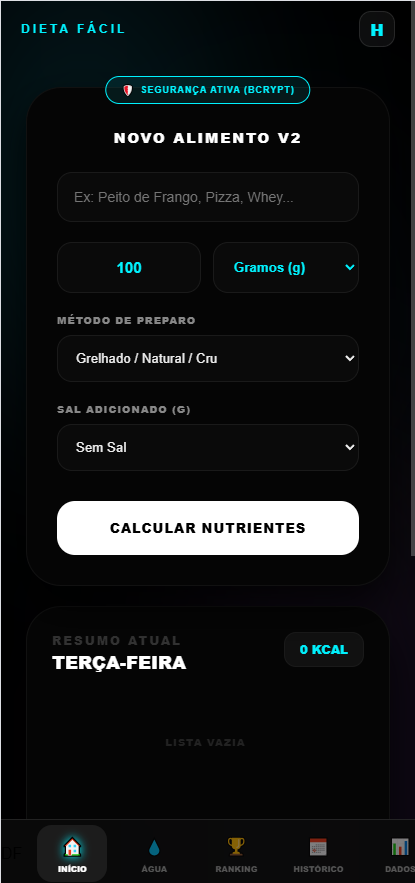 | 
|  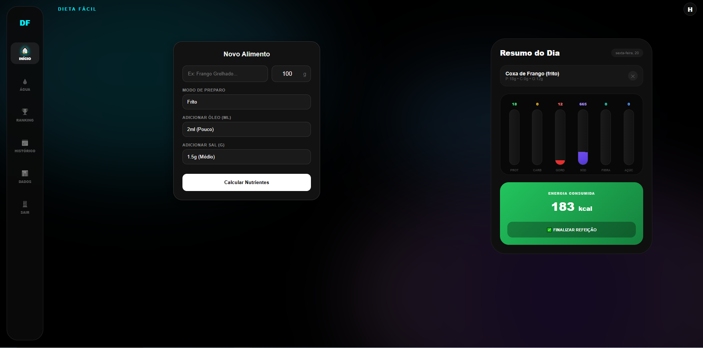 |
|  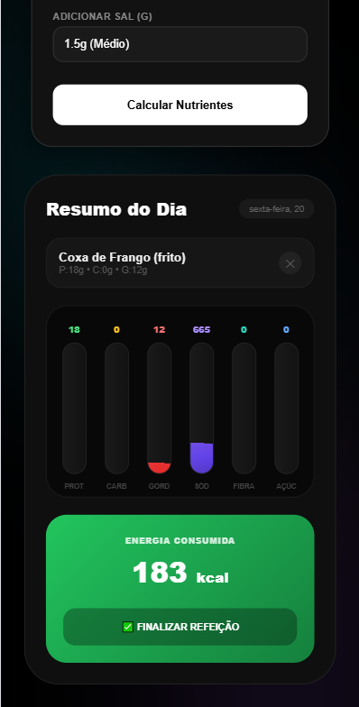 |

| MFA | Recuperar acesso
| :---: | :---: |
| 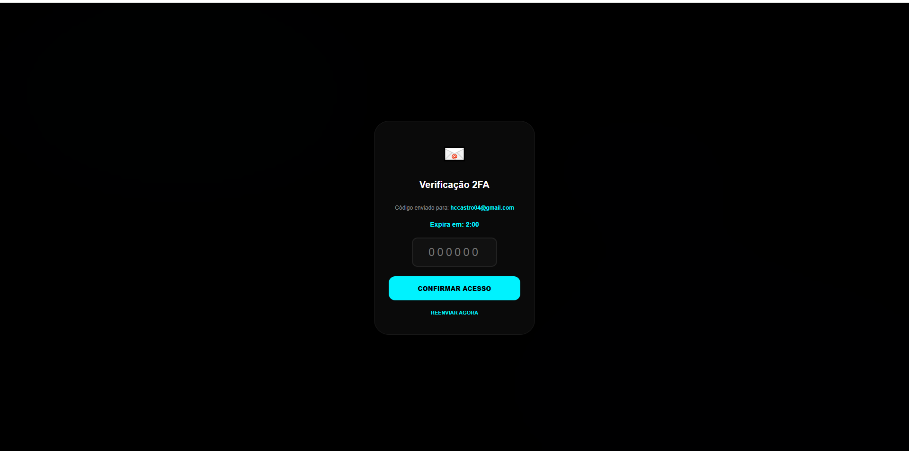 |
| 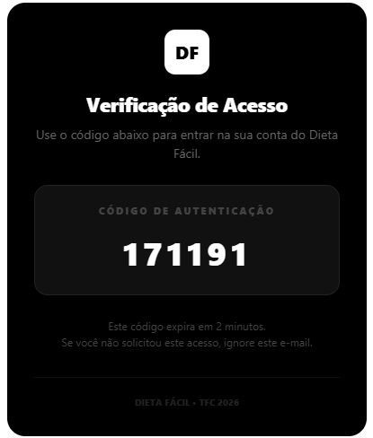 |
| 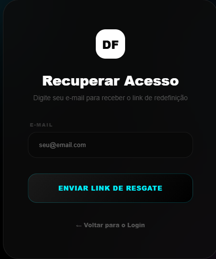 |

| Controle de Água | Ranking e Gamificação |
| :---: | :---: |
| 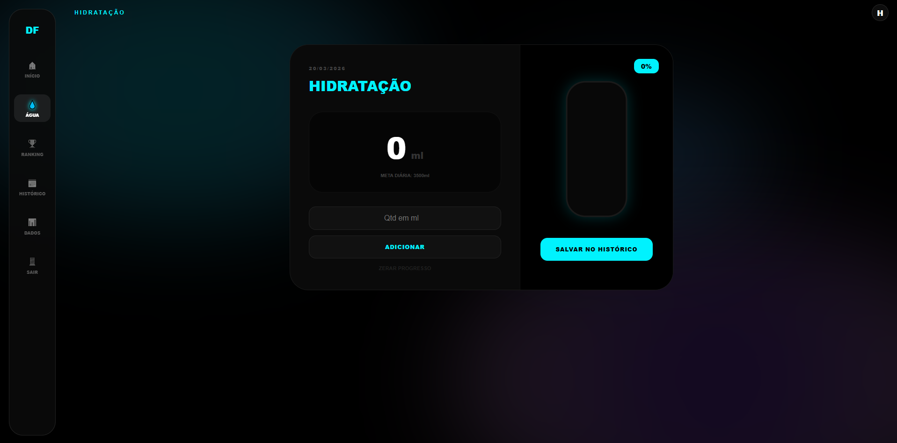 |
| 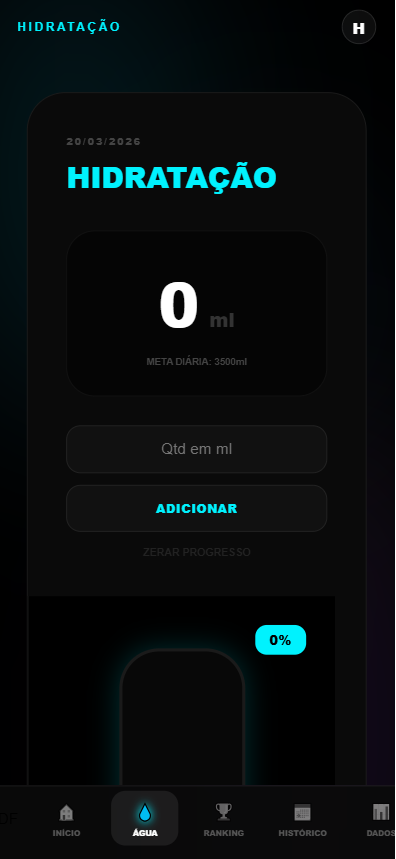 | 
| 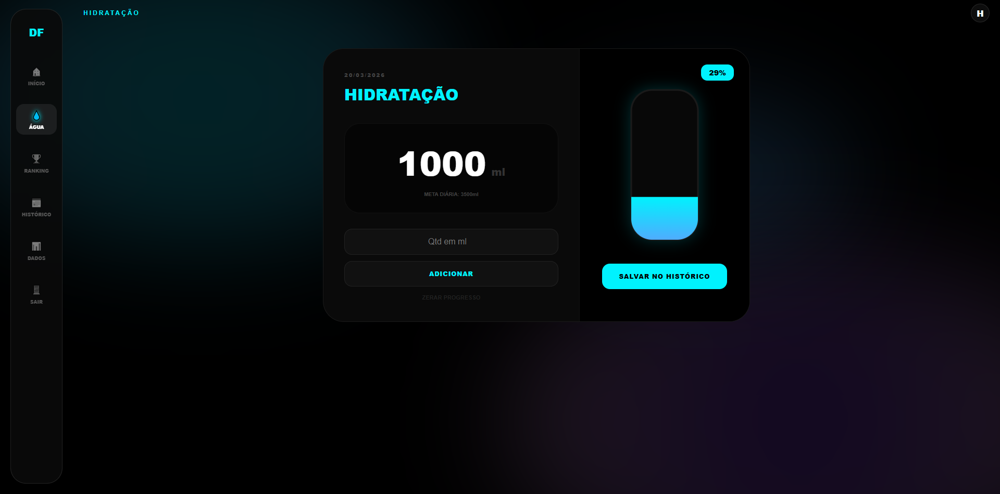 | 
| 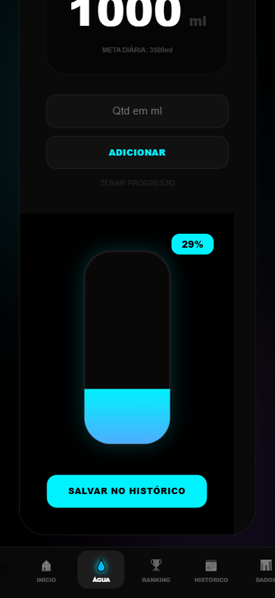 | 
|  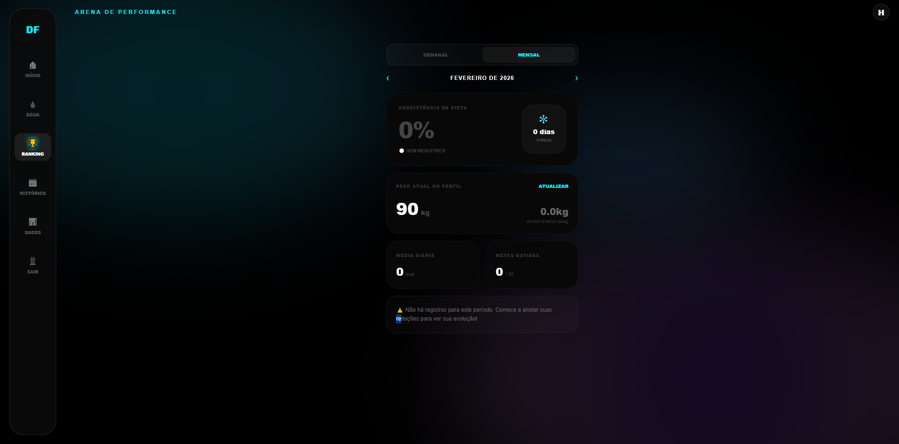 |
|   |
|  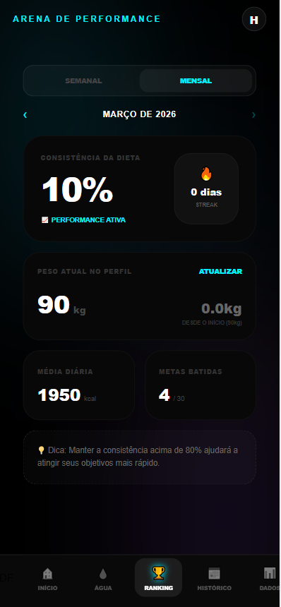 |

| Historico | Calendario |
| :---: | :---: |
| 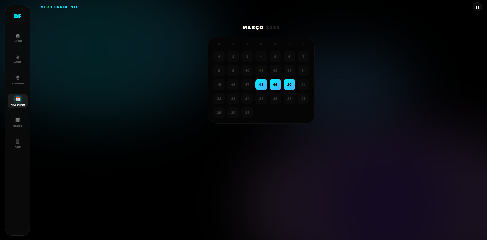 |
| 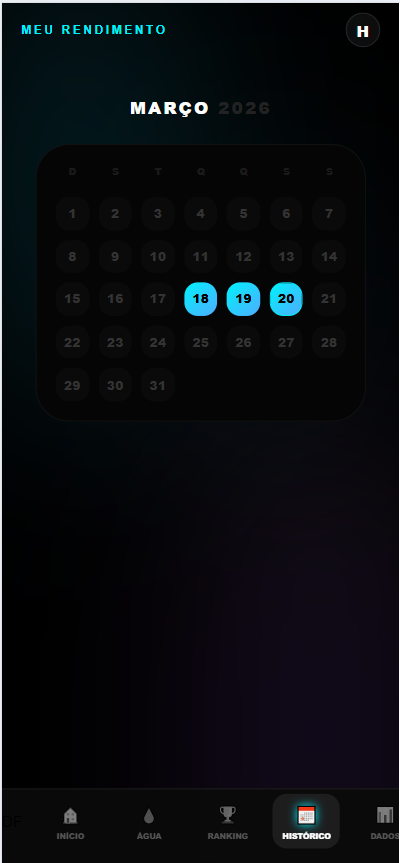 |
| 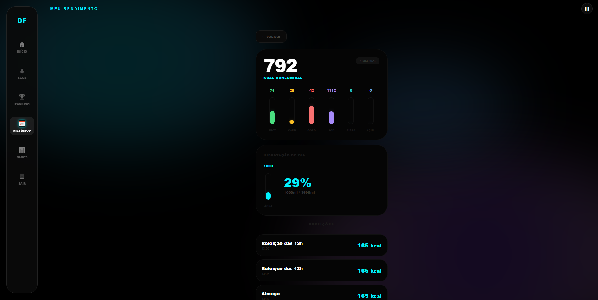 |
| 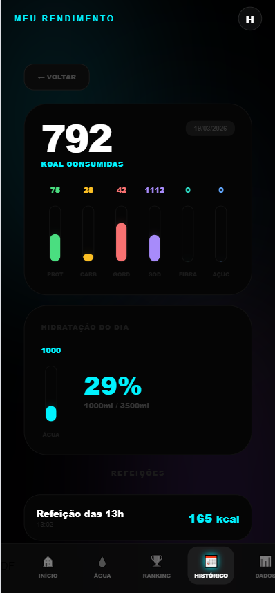 |
| 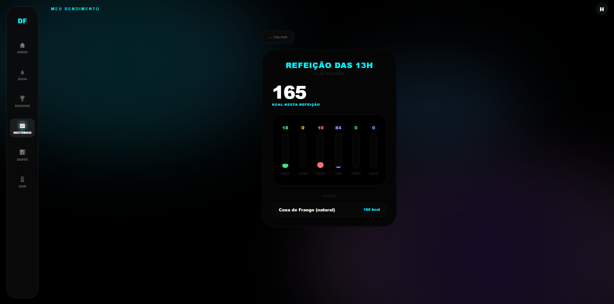 |
| 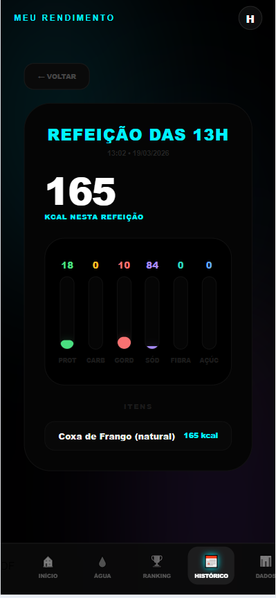 |

| Dados |
| :---: |
| 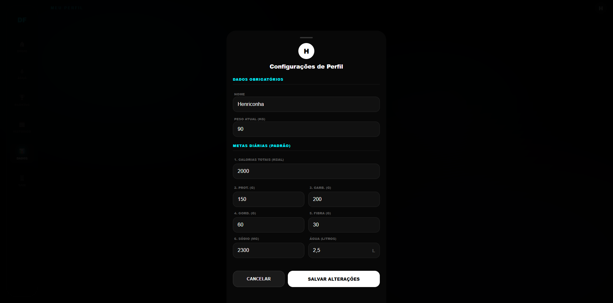 |
| 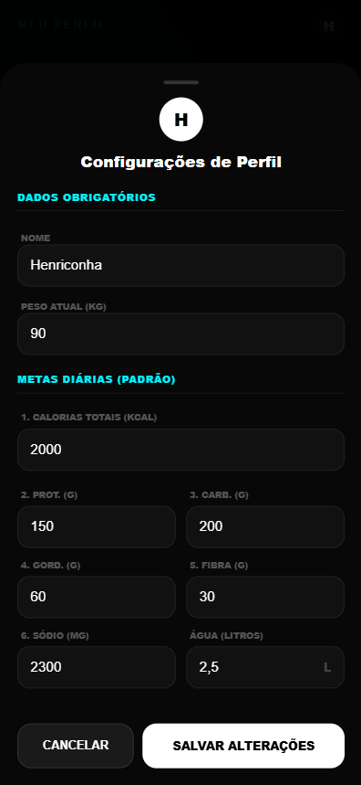 |


---

## 🏗️ Arquitetura de Dados (Fluxo de 4 Camadas)

Para garantir alta disponibilidade e performance, o sistema segue este fluxo de decisão:

1.  **Static Layer:** Consulta local instantânea em arquivos JSON para alimentos comuns.
2.  **User Cache (Firebase):** Busca se o alimento já foi "aprendido" pelo sistema anteriormente por qualquer usuário da base.
3.  **Cloud IA (Gemini 2.0):** Processamento via IA Generativa caso o alimento seja inédito.
4.  **Auto-Learning:** Após o retorno da IA, o dado é sanitizado e persistido no Firebase para consultas futuras de toda a comunidade.

---

## 🛠️ Tecnologias e Bibliotecas

* **React + TypeScript:** Interface reativa com tipagem forte (Type-Safe).
* **Vite:** Ferramenta de build de alta performance.
* **Firebase SDK:** Gerenciamento de banco de dados (Firestore) e autenticação.
* **Google Generative AI SDK:** Integração com os modelos Flash mais recentes.
* **Zustand:** Gerenciamento de estado global com persistência de sessão.
* **Tailwind CSS:** Design responsivo e moderno com foco em UX.

---

## 🚀 Como Instalar e Rodar

### 1. Pré-requisitos
* Node.js instalado (v18+)
* Chave de API do [Google AI Studio](https://aistudio.google.com/)

### 2. Instalação Automática (Windows)
Nós automatizamos o setup! Basta executar o script na raiz do projeto:
```bash
.\setup.bat
```

### 3. Configuração Manual
Crie um arquivo .env na raiz do projeto e insira sua chave:

Snippet de código
```bash
VITE_GEMINI_API_KEY=sua_chave_aqui

# Firebase Configuration
VITE_FIREBASE_API_KEY=sua_chave_aqui
VITE_FIREBASE_AUTH_DOMAIN=seu-app.firebaseapp.com
VITE_FIREBASE_PROJECT_ID=seu-projeto-id
VITE_FIREBASE_STORAGE_BUCKET=seu-storage-bucket
VITE_FIREBASE_MESSAGING_SENDER_ID=seu-id
VITE_FIREBASE_APP_ID=seu-app-id
```

### 4. Execução
```bash
npm run dev
```

### 👥 Autores e Colaboradores
**Henrique Castro - Engenharia de Software / Back-end & Arquitetura**

## 📌 Roadmap (V3)

* [ ] Implementação de Dashboards com gráficos de evolução temporal (Recharts).

* [ ] Sistema de reconhecimento de alimentos via imagem (Gemini Vision).

* [ ] Exportação de relatórios nutricionais em PDF para nutricionistas.
